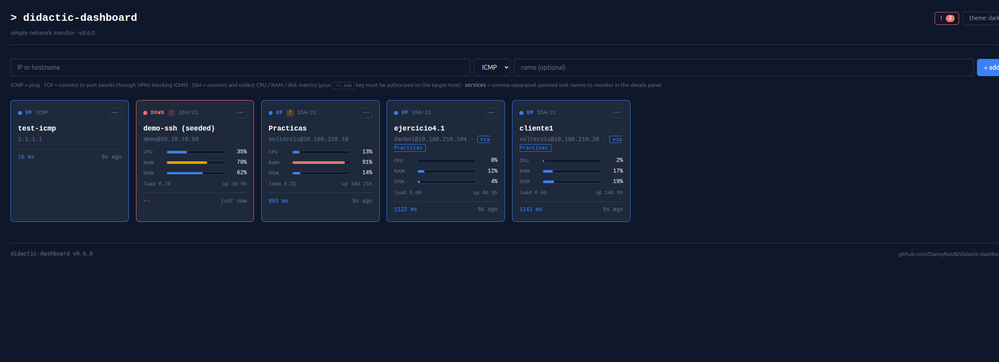
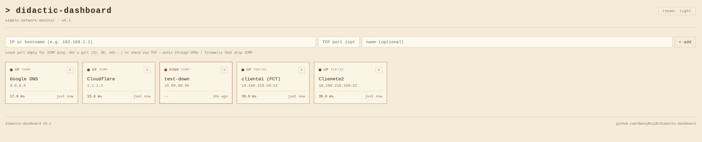
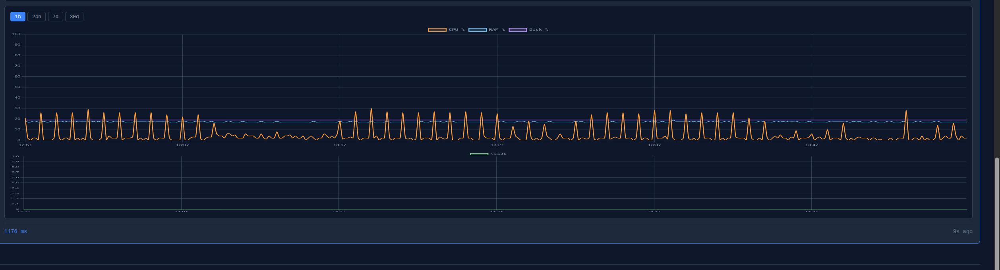
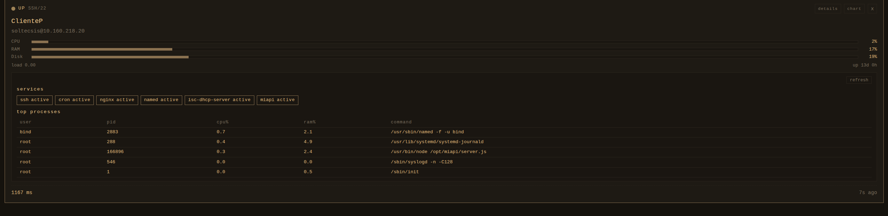
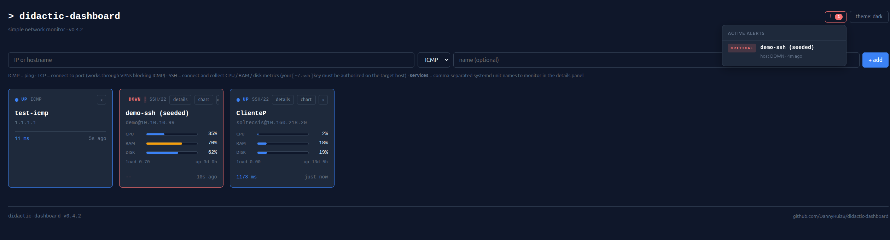
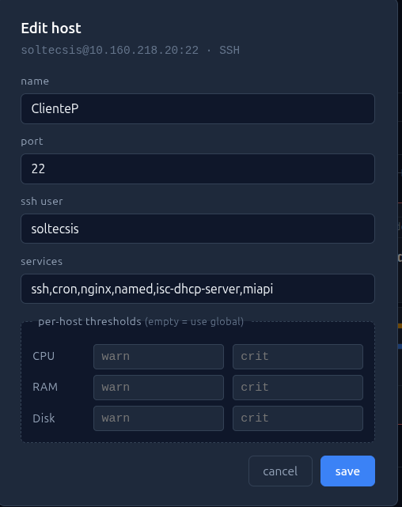
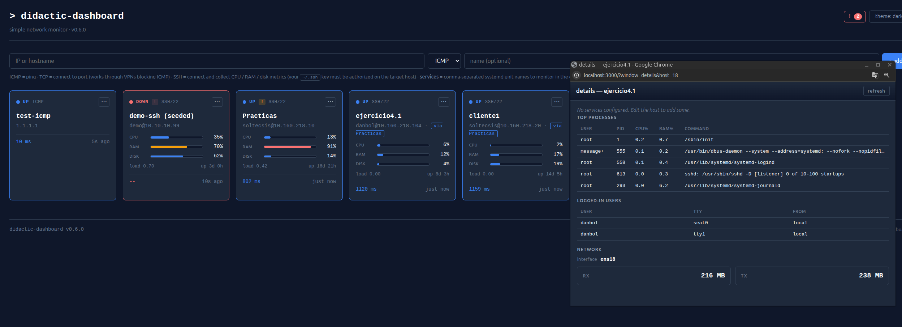

# didactic-dashboard

### [Try the live demo →](https://didactic-dashboard.onrender.com)


[](https://hub.docker.com/r/dannyruizb/didactic-dashboard)
[](https://hub.docker.com/r/dannyruizb/didactic-dashboard)


Simple self-hosted monitoring dashboard. Add a host by IP and watch its status in real time. Docker-ready, built for learning.

> Work in progress — v0.6.0 released, more features coming.

## Screenshots

Dark theme:



Light theme:



History charts (click the `chart` button on any SSH host):



Host details — systemd services + top processes + logged-in users + network traffic (click the `details` button on any SSH host):



Active alerts — bell icon in the header opens a dropdown with hosts crossing CPU / RAM / disk thresholds or going DOWN:



Edit host — click the `edit` button on any card to rename, change port / SSH user / monitored services, or override the global alert thresholds for that host (empty fields fall back to the defaults):



Pop-out windows — every action (chart, details, discover) opens as a floating window inside the dashboard, but the `↗` button in the window header re-opens it as a real browser window so you can drag it to a second monitor:



## Live demo

A public demo with pre-seeded hosts (Google, Cloudflare, GitHub, Docker Hub, example.com) is running at **https://didactic-dashboard.onrender.com** — hosted on Render free tier, so the first request after idle may take ~30s to wake up. SSH check mode is disabled on the demo, and only **public** hosts work — LAN IPs (`192.168.x`, `10.x`...) are unreachable from the cloud sandbox. To monitor your own network, self-host with the Quick start above.

## Quick start

### Option A — one-liner from Docker Hub (fastest)

```bash
docker run -d --name didactic-dashboard \
  -p 3000:3000 \
  -v didactic-data:/app/data \
  -v ~/.ssh:/root/.ssh:ro \
  dannyruizb/didactic-dashboard:latest
```

The `-v ~/.ssh:/root/.ssh:ro` mount lets the container reuse your existing SSH keys for the SSH check mode. Drop that line if you only plan to use ICMP / TCP checks.

### Option B — clone and build

```bash
git clone https://github.com/DannyRuizB/didactic-dashboard.git
cd didactic-dashboard
docker compose up -d --build
```

Open http://localhost:3000 and start adding hosts by IP or hostname.

Data persists in the `didactic-data` volume (Option A) or `./data/dashboard.db` (Option B).

## Features

### v0.6.0 (current)
- **Auto-discovery from a Proxmox node**: tick *Proxmox node* when adding an SSH host and a `discover` button shows up on its card. Clicking it lists every VM and LXC container on that Proxmox node — without installing anything inside the guests — by cross-referencing `qm list` / `pct list` / `qm config` / `pct config` with the Proxmox node's ARP cache (`ip neigh show`) to resolve each guest's IP. Tick the ones you want, type a shared SSH user, and they're adopted as monitored hosts with a `via <parent>` tag on their card.
- **Per-host threshold overrides** (v0.5.2): every SSH host can override the global CPU / RAM / disk thresholds from the UI. Set them at add-time in the `+ thresholds` block, or click `edit` on any card to change them later. A small `th` badge shows up on cards with custom thresholds. Leave a field empty to fall back to the global env var.
- **Edit host**: every card now has an `edit` button so you can rename a host, change its port / ssh user / monitored services, and tune its alert thresholds without deleting and re-creating it.
- **Email (SMTP) notifications** (v0.5.1): set `SMTP_HOST` + `ALERT_EMAIL_TO` (plus the usual auth) and every alert transition is sent as an email with auto-built subject and HTML / plain-text body. README has a step-by-step for Gmail (app password) and notes for other providers.
- **Alerts engine** (v0.5.0): every check evaluates the host against thresholds and fires `warning` / `critical` alerts when a metric crosses them. A bell badge in the header counts active alerts and opens a dropdown listing them; affected cards get a small `!` indicator. A consecutive-failure counter (default 2) prevents single-blip false positives on the host-DOWN alert.
- **Webhook notifications**: set `ALERT_WEBHOOK_URL` and the dashboard POSTs a JSON payload (`event`, `host`, `metric`, `level`, `value`, `threshold`, `timestamp`) on every alert transition (fired / cleared). Works with Discord, Slack, ntfy.sh, custom endpoints — anything that accepts a webhook.
- **Configurable thresholds**: `CPU_WARN`, `CPU_CRIT`, `RAM_WARN`, `RAM_CRIT`, `DISK_WARN`, `DISK_CRIT` env vars set the **global defaults** (sensible: 70/90 for CPU, 80/95 for RAM, 80/90 for disk). Override per-host from the UI.
- **Redesigned UI** (v0.4.2): sober slate + blue palette, system sans-serif for labels and titles, monospace kept for technical data (IPs, metrics, commands, services). Same dark / light toggle, less eye strain, more professional look.
- **Host details panel** (SSH only): click the `details` button on any SSH card to see
  - **systemd services**: live `active` / `inactive` / `failed` state for any units you configured for that host
  - **top 5 processes** by CPU (the probe filters its own session out, so you see real workload)
  - **logged-in users**: who, on which tty, from where (own SSH probe filtered out)
  - **network traffic**: default-route interface plus cumulative RX / TX bytes, humanised (KB / MB / GB)
- Per-host services list configured at add time (comma-separated unit names, e.g. `ssh,cron,nginx`)
- Three check modes per host:
  - **ICMP** — classic ping (default)
  - **TCP** — connect to a given port (works through VPNs / firewalls blocking ICMP)
  - **SSH** — connect, run a small command and collect real-time metrics
- **Metrics** (SSH only): CPU %, RAM %, Disk %, load avg, uptime — with live progress bars
- **History charts**: click any SSH host to see CPU / RAM / disk / load1 over the last `1h`, `24h`, `7d` or `30d`
- Add / remove hosts by IP or hostname from the web UI
- SQLite persistence (hosts, ping history, metrics history)
- One-command Docker Compose deploy
- Warm amber theme with light / dark toggle (persists in localStorage)

### Planned
- More discovery types (Docker hosts, libvirt) — only Proxmox in v0.6.0

## Why

A lightweight, didactic alternative to Zabbix — simple enough to read, modify and learn from. Great for home labs and small sysadmin practice environments.

## Tech stack

- Node.js + Express (backend)
- SQLite (storage)
- Vanilla HTML / CSS / JS (frontend)
- Docker + Docker Compose (deploy)

## Roadmap

- [x] v0.1 — Add/remove hosts via UI, ICMP + TCP checks, Docker Compose
- [x] v0.2 — SSH-based metrics (CPU, RAM, disk, load, uptime) with live bars
- [x] v0.3 — History charts (1h / 24h / 7d / 30d) per SSH host
- [x] v0.4.0 — Host detail panel: systemd services + top processes
- [x] v0.4.1 — Host detail panel: connected users + network traffic
- [x] v0.4.2 — UI redesign (slate + blue palette, sans / mono mix)
- [x] v0.5.0 — Alerts engine + webhook notifications
- [x] v0.5.1 — Email (SMTP) notifications
- [x] v0.5.2 — Per-host threshold overrides from the UI
- [x] v0.6.0 — Proxmox auto-discovery (parent → VMs / LXC adoption)

## SSH check setup

To use the SSH check mode and collect metrics from remote hosts:

1. Make sure your **SSH key** (`~/.ssh/id_ed25519.pub` or `id_rsa.pub`) is on the target host in its `~/.ssh/authorized_keys`. See [first-time setup](#first-time-ssh-setup) below if you don't have one yet.
2. The container mounts your `~/.ssh` as **read-only** (`~/.ssh:/root/.ssh:ro`), so it reuses your keys without copying them.
3. When adding a host, pick **SSH** as the check type and enter the remote user (e.g. `root`, `ubuntu`, `soltecsis`...). Port defaults to `22`.
4. *(Optional)* In the **services** field, list the systemd unit names you want to monitor for that host, comma-separated (e.g. `ssh,cron,nginx,named`). They show up in the `details` panel with their live state.
5. The target host only needs standard tools (`ps`, `top`, `free`, `df`, `awk`, `/proc`, plus `systemctl` for the services panel) — no agent install required.

The remote user does **not** need root. Standard user privileges are enough for the metrics collected and for `systemctl is-active` queries.

### First-time SSH setup

If you've never used SSH key auth before, three commands set it up:

```bash
# 1. Generate a key pair (press Enter to accept defaults; leave the passphrase
#    empty unless you also run an ssh-agent)
ssh-keygen -t ed25519 -C "you@example.com"

# 2. Copy the public key to the host you want to monitor
ssh-copy-id user@host

# 3. Verify you can connect without typing a password
ssh user@host 'echo ok'
```

That's it — the dashboard reuses the same key, so once `ssh user@host` works on your machine, the SSH check mode will work too.

On **Windows PowerShell** (10/11) `ssh-keygen` is built-in but `ssh-copy-id` isn't. Replace step 2 with:

```powershell
type $env:USERPROFILE\.ssh\id_ed25519.pub | ssh user@host "cat >> .ssh/authorized_keys"
```

The target host needs an SSH server running (`sudo apt install openssh-server` on Debian/Ubuntu, already installed on most cloud VMs) and your user must exist on it.

### Troubleshooting

- **Card stays DOWN on an SSH host.** First check from a regular shell that `ssh user@host 'echo ok'` works without prompting — if it asks for a password the dashboard can't help (it runs SSH in `BatchMode`, no interactive prompts).
- **`Permission denied (publickey)`.** Your public key isn't in the target's `~/.ssh/authorized_keys`. Re-run `ssh-copy-id` or paste it manually.
- **No metrics appear but the host is UP.** The metrics collector needs `top`, `free`, `df`, `awk` and `/proc`. Almost every Linux has them; minimal containers (Alpine, distroless) may not.
- **Services show `unknown`.** That host doesn't use systemd, or the unit name is wrong. Try `systemctl is-active <name>` directly on the host.

## Configuration

Environment variables (set in `docker-compose.yml`):

| Variable             | Default                   | Meaning                                              |
|----------------------|---------------------------|------------------------------------------------------|
| `PORT`               | `3000`                    | HTTP port                                            |
| `DB_PATH`            | `/app/data/dashboard.db`  | SQLite file path                                     |
| `PING_INTERVAL`      | `10000`                   | Ping period in ms                                    |
| `CPU_WARN`           | `70`                      | Global default CPU % `warning` threshold (overridable per-host) |
| `CPU_CRIT`           | `90`                      | Global default CPU % `critical` threshold (overridable per-host) |
| `RAM_WARN`           | `80`                      | Global default RAM % `warning` threshold (overridable per-host) |
| `RAM_CRIT`           | `95`                      | Global default RAM % `critical` threshold (overridable per-host) |
| `DISK_WARN`          | `80`                      | Global default Disk % `warning` threshold (overridable per-host) |
| `DISK_CRIT`          | `90`                      | Global default Disk % `critical` threshold (overridable per-host) |
| `ALERT_DOWN_AFTER`   | `2`                       | Consecutive failed checks before firing host-DOWN    |
| `ALERT_WEBHOOK_URL`  | (unset)                   | If set, POST a JSON payload on each alert transition |
| `SMTP_HOST`          | (unset)                   | SMTP server hostname (enables the email channel)     |
| `SMTP_PORT`          | `587`                     | SMTP port (`465` for SSL, `587` or `25` for STARTTLS) |
| `SMTP_USER`          | (unset)                   | SMTP login user                                      |
| `SMTP_PASS`          | (unset)                   | SMTP login password                                  |
| `SMTP_SECURE`        | `false`                   | `true` for implicit TLS (port 465), `false` otherwise |
| `ALERT_EMAIL_FROM`   | (= `SMTP_USER`)           | `From:` header for outgoing alerts                   |
| `ALERT_EMAIL_TO`     | (unset)                   | Destination address (enables the email channel)      |

## Alerts

The dashboard fires `warning` / `critical` alerts in three situations:

- A host has been DOWN for `ALERT_DOWN_AFTER` consecutive checks (always `critical`).
- An SSH host's CPU / RAM / disk usage crosses one of the threshold env vars.
- A previously firing alert clears (e.g. CPU drops back below `CPU_WARN`, host comes back UP).

Active alerts show up in the bell badge in the header and as a small `!` on each affected card.

If you set `ALERT_WEBHOOK_URL`, the dashboard sends a `POST` with this JSON body on every `alert.fired` and `alert.cleared` transition:

```json
{
  "event": "alert.fired",
  "alert_id": 42,
  "host": { "id": 3, "ip": "10.0.0.5", "name": "web-01", "check_type": "ssh" },
  "metric": "cpu",
  "level": "critical",
  "value": 92.4,
  "threshold": 90,
  "timestamp": "2026-04-27T12:34:56.789Z"
}
```

This is provider-agnostic — point it at a Discord webhook, a Slack incoming webhook, an [ntfy.sh](https://ntfy.sh) topic, or your own service. For Discord/Slack you may want a small relay that reshapes the payload to their expected schema; the JSON above is the source of truth.

### Email (SMTP)

Set `SMTP_HOST` and `ALERT_EMAIL_TO` to enable the email channel. Subject and body are auto-built (`[CRITICAL] CPU on web-01 — 92.4%`, with HTML and plain-text versions).

**Gmail.** Google requires an *app password* — your normal Gmail password will not work over SMTP.

1. Enable 2-Step Verification on your Google account (`myaccount.google.com/security`).
2. Visit [`myaccount.google.com/apppasswords`](https://myaccount.google.com/apppasswords) and create one named e.g. `didactic-dashboard`.
3. Use the 16-character app password as `SMTP_PASS`. Then:

```yaml
- SMTP_HOST=smtp.gmail.com
- SMTP_PORT=465
- SMTP_SECURE=true
- SMTP_USER=you@gmail.com
- SMTP_PASS=xxxxxxxxxxxxxxxx        # the app password
- ALERT_EMAIL_FROM=you@gmail.com
- ALERT_EMAIL_TO=ops@example.com    # where alerts land
```

**Other providers.** Any SMTP server works (Outlook 365, Mailgun, SendGrid, your corporate relay…). For development without sending real mail, [Mailtrap](https://mailtrap.io) and [MailHog](https://github.com/mailhog/MailHog) both expose a fake SMTP that captures messages in a UI.

## License

MIT — see [LICENSE](LICENSE)

## Author

Danny Ruiz — [github.com/DannyRuizB](https://github.com/DannyRuizB)
